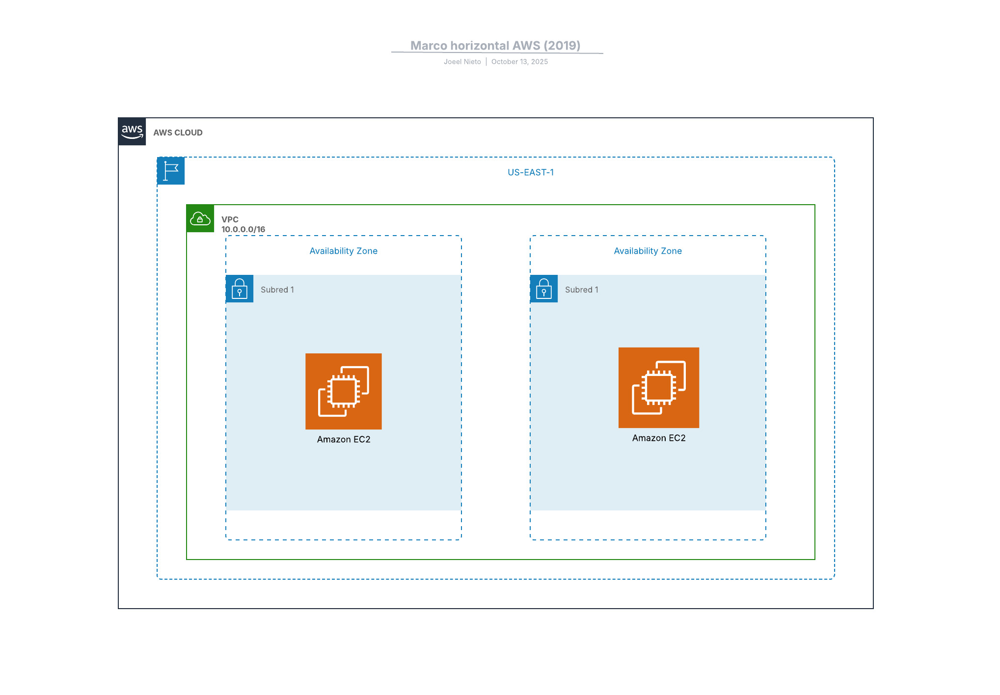

Exercici 1:
Aquest exercici crea dues instàncies EC2 del tipus t3.micro amb Amazon Linux 2023 a la regió us-east-1, utilitzant Terraform.

També s’ha fet una topologia a LucidChart que mostra les dues instàncies dins d’AWS. La imatge del diagrama es troba dintre de assets.
