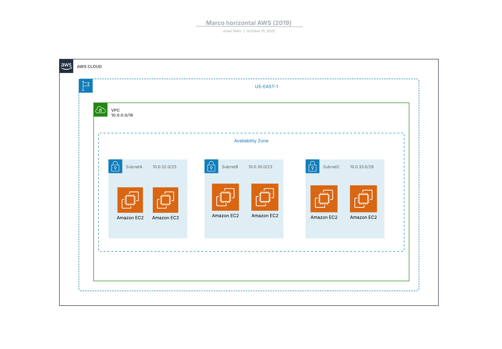

En aquest exercici s’ha creat una VPC (10.0.0.0/16) amb 3 subnets dins la mateixa zona de disponibilitat us-east-1a:

SubnetA: 10.0.32.0/25

SubnetB: 10.0.30.0/23

SubnetC: 10.0.33.0/28

Cada subnet conté 2 instàncies EC2 del tipus t3.micro amb Amazon Linux 2023.

La topologia es pot visualitzar al diagrama creat amb LucidChart dins la carpeta:
assets/Imatges/topologia.png

El desplegament s’ha realitzat tant:

Per consola d’AWS (interfície gràfica) — amb captures dels recursos creats.

Amb Terraform, definint tota la infraestructura com a codi a la carpeta pt1-3-ex2/.

