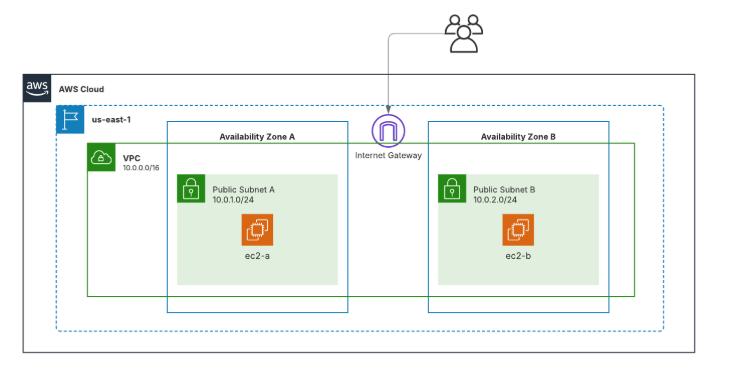

El ejercicio crea con Terraform una infraestructura básica en AWS: una VPC con dos subredes públicas, un Internet Gateway, una tabla de rutas, un grupo de seguridad y dos instancias EC2 (una en cada subred).
Permite practicar cómo desplegar y conectar recursos en la nube de forma automatizada.

